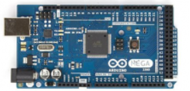
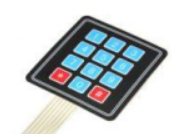
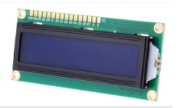
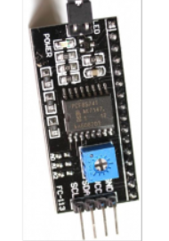
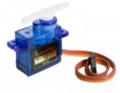
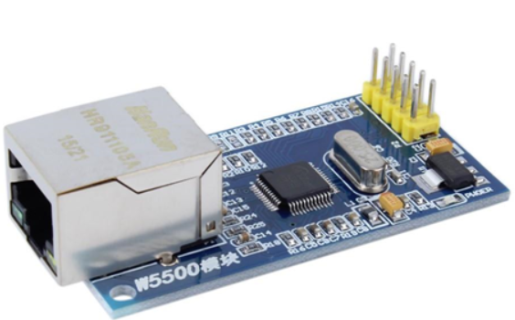
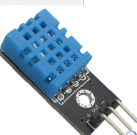
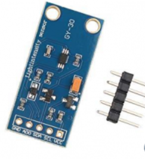
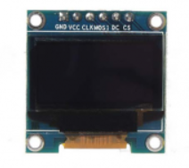
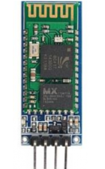

# smart_home_modell
Smart Home modell

Igazából még soha nem írtam fejlesztői dokumentációt, de megpróbálok valamit kihozni belőle. Egyedül dolgoztam a projekten és az ötlet onnan jött, hogy manapság minden az IoT (Dolgok Internete) körül forog, akkor próbálkozzunk meg egy lakásnak az „okosításával”. Ehhez az Arduino rendszerét választottam, amit egy c/c++ klónon (fejlesztői IDE) keresztül lehetett programozni. Ez okozott néha kellemetlenséget, mert nem „tiszta” fejlesztői környezetként a c++-ban megismert eszközök nem mindig és nem olyan módon működnek, mint ahogyan egy PC fejlesztői környezetében. A másik sok fejtörést okozó dolgok voltak a működésbe bevont header fájlok sokszor hiányos leírása-forráskódja, aminek tesztelése (vagy működésükről információ felkutatása) rendkívül időrabló tudott lenni. Bár a feladatot nem sikerült maradéktalanul olyan szinten befejezni, ahogy szerettem volna, de majd vizsgaidőszak végeztével még biztosan folytatni fogom az ötlet megvalósítását és még további fejlesztését. Erről később majd bővebben is írnék majd. 
A projekthez vásárolt eddigi eszközök, szenzorok:

•	Arduino Mega 2560

 

•	Arduino KP-4X3/MEM tasztatúra billentyűzet

 

•	Szalagkábelek
•	Arduino KC-1602-BB LCD kék-fehér kijelző

 

•	Arduino LCD-I2C-IF interfész adapter az LCD kijelzőhöz

 

•	Arduino MS/SG90 micro servo

 

•	Különféle méretű és színű led lámpák (egyszerű programozásuk miatt csak később kerülnek majd beépítésre)
•	HanRun HR911105A W5500 típusú SPI ethernet modull

 

•	Arduino DHT11-M hőmérséklet és páratartalom érzékelő

 

•	Arduino GY-30 környezeti fényérzékelő

 

•	Arduino D096-12864-SPI6 OLED kijelző

 

•	PIR mozgásérzékelő szenzor
•	Breadboard
•	Kapcsoló + tápegység külön a breadboardhoz
•	Mágneses nyitásérzékelő szenzor
•	Ellenállások a led lámpákhoz

Tervezett még a projekthez vásárolni:
•	Arduino MHC-05/4 bluetooth modul

 

•	Arduino MICROSD-M microsd kártya kezelő modul

•	Illetve ide kapcsolódik még, hogy összekapcsolni az itthon QNAP szerverrel (kipróbálásra került és sikeres volt, de mivel még van mit rajt csiszolni nem került bele a vizsgaanyagba)

A fenti felsorolásból a vizsgaanyagba beépítésre kerültek, aminek a működése „majdnem” tökéletes:

	Arduino Mega 2560

	Arduino KP-4X3/MEM tasztatúra billentyűzet

	Szalagkábelek

	Arduino KC-1602-BB LCD kék-fehér kijelző

	Arduino LCD-I2C-IF interfész adapter az LCD kijelzőhöz

	Arduino MS/SG90 micro servo

	Arduino DHT11-M hőmérséklet és páratartalom érzékelő

	Arduino D096-12864-SPI6 OLED kijelző

	Breadboard

	Kapcsoló + tápegység külön a breadboardhoz

	Illetve felhasználásra került a belső EEPROM , mint adatbázis tárolási helye, amely a jövőben átkerül majd SD kártyára, illetve majd a NAS-ra (is)– bár  az EEPROM is közel  100000 írási ciklust ki kellne, hogy bírjon a leírások alapján

A projekt első részében bár nem kerültek „commitba”, de olyan feladatok kerültek elvégzésre, mint a szenzorok tesztelése („serial”-ra) íratása. A következő lépésben forrasztópáka beszerzése után az I2C beforrasztása volt az LCD kijelző kivezetéseire. Ezt azért gondoltam szükségesnek, mert így kevesebb „port”-ra van szükség a kommunikáció megvalósítására. A mega2560-on (a feszültség és a földelés mellett) az adatcsere az I2C buszon keresztül – természetesen megcímezve – a 20-as SDA és a 21-es SCL portokon valósult meg. 

A kommunikációhoz szükséges cím megszerzése egy segédprogrammal valósult meg, amelyet szintén a rövidsége miatt nem részletezném. 
Külön segédprogrammal volt tesztelve a szervo motor működése, amelyet egy reteszzárt modellezne. Tengelyállástól (0-180) függően bezár – eltolva a reteszeket – vagy kinyit. 

A következő lépést a tasztatúra felprogramozása és tesztelése – LCD-re való kiíratása volt. 
Eredetileg nem a 22-28 –as „pin”-eken működött, csak később került áthelyezésre, hogy más szenzoroknak és esetleges vezérléseknek több hely legyen. 

A koncepció az volt ebben az első részben, hogy a program a tasztatúráról bekér néhány számot – mint egy jelszót – megvizsgálja, hogy a megadott szám megegyezik-e a programban eltárolt számmal. Ha egyezés van, akkor képernyőre írja, hogy „correct” és a tengely állásától függően mozgatja a szervónak a motorját és tájékoztatást ír az LCD-re, hogy a reteszzár éppen nyit, vagy zár (deadlock). Ha nem egyezik, akkor újraindul a ciklus.

Mindezek a dolgok szerepelnek az első commit-ban (fájlnév: tastat_v2_2.ino) 

Hátránya ennek a résznek, hogy a beforrasztott I2C busz-on található kontrasztot állító potméter rendkívül szűk tartományban képes működni. 

A projekt második részében egy menürendszer került megvalósításra és hozzá kapcsolódóan más funkciók is, mint amik eddig voltak. Itt lett csatlakoztatva egy OLED kijelző is a könnyebb megvalósítás és a megnövekedett helyigény kielégítésére. Az OLED 128x64-es felbontású, és ez került csatlakoztatásra. Működőképes header fájlt is sikerült találni hozzá. A kapcsolatot a digitális SPI interfészen keresztül sikerült létesíteni. 

Használt pinek:

51: MOSI

52: Clock

48: DC

49: Reset

12: CS

Nem túl jól működik viszont az Arduino-hoz kapcsolt OLED, ha szervo is van csatlakoztatva, mert ilyenkor a kijelző elég hektikusan működik. Próbáltam keresni a net-en megoldásokat, de nem sok jót ígértek a fórumokon sem. Talán egy kondenzátor használata – vagy ellenállások garmadájával kísérletezve – megoldja majd a problémát. 

Ebben a részben az OLED kijelzőn van a választható menüpontok és az LCD-n várja program a tasztatúráról a beérkező választást: 
1. Security 
2. Temperature 
3. Light 
4. Panic button 
5. Change password

Ezekből egyelőre az első kettő és az utolsó került kidolgozásra, bár az első ponthoz még biztosan lesz néhány funkció hozzáadva. 

Itt szeretném megemlíteni, hogy következő változatban található funkciót is itt írnám le, hiszen csak annyival tud többet, hogy az első pontban megadott funkciók lettek kibővítve és az ötös pont megvalósítása is később történt. Nevezetesen ugyanúgy maradt a retesz nyitása – zárása, csak a megadott jelszó ellenőrzését egy Epromban tárolt adatbázisból kiolvasva végzi, és ha nem megfelelő a jelszó, akkor kiírja és visszalép a főmenübe.

(A jövőben beépítésre fog kerülni, hogy csak megadott számú alkalommal próbálkozhat a jelszóval, és ha így sem jó egy időre letiltja a rendszer – üzenetet küld mailben – és esetlegesen csak a „master” kulccsal lesz nyitható – zárható)

A második menüpontot választva a hőmérséklet és páratartalom kerül kiírásra (DHT11 szenzor a 10-es pinen kommunikál), az LCD-re és az OLED-en lehetőség van a környzeti hőmérséklet beállítására. Megkérdezi, hogy szeretném-e beállítani a hőmérsékletet, és ha igen akkor egy kétjegyű számot vár a program. Természetesen ez a számot is el kell fogadtatni. Ha elfogadtam a számot, akkor a környezeti hőmérséklettől függően (megvizsgálva a szenzorról érkező adatot) fűtés, vagy hűtés "indul" a modellben, amiről a felhasználó az OLED-en kap tájékoztatást. Ha valós lenne, akkor ezeket könnyűszerrel meg lehet valósítani egy-két "pin" értékét magasra állítva egy-egy relét vezérelve és időként vizsgálva a szenzorról érkező értéket és ha szükséges akkor kikapcsolni a relét (pin alacsonyra állításával).

Az utolsó menüpontban lehetőség van az eprom-ban tárolt jelszó módosítására. Ehhez meg kell adni a régi jelszót. Ezt leellenőrzi a program. Ha nem helyes visszamegy a főmenübe és kiírja, hogy nem volt jó a jelszó. Ha helyes (Epromból keresi a megadott jelszót),  akkor meg kell adni az új jelszót a felhasználónak. Az új jelszót a felhasználónak meg kell ismételnie, és ha egyezik mind a kettő akkor a régi helyére beírja  a program az új jelszót.

Sajnos ez a funkció tartalmaz némi hibát (gyanítom, hogy az Eprom sajátossága miatt – nem volt idő teljesen elmélyedni hogy milyen módón valósították meg az elektronikát - soronként, oszloponként vagy blokkonként van megoldva a programozási lehetőség - vagy egy blokk hány bájt...). Az adatot beírja, de flash memóriában lévő, módosított adatot követő adatokat az Arduino törli. 
Erre majd megoldást két dolgot fogok majd vizsgaidőszakon kívül kipróbálni: 

-	kiolvasom egy tömbbe az adatokat – csak amit szükséges – és az adatmódosítás követően visszaírom őket az Epromba
-	a másik megoldás, hogy egy SD kártya olvasóba tárolom el az adatokat valamilyen formában (string, szám?)

Számos helyen az adatok ellenőrzését a COM3-ra való kiíratással lehetett ellenőrizni. 

A jövőben szeretnék hozzácsatlakoztatni a rendszerhez egy mágneses nyitásérzékelőt és egy PIR mozgásérzékelőt. A terv az, hogy az innen származó adatokat csak akkor veszi figyelembe, ha a nem lesz otthon senki. Lesz külön kód az otthoni bezárkózásra, és ha elmegy otthonról. Azt is szeretném majd megvalósítani, hogyha nem lesz otthon senki (zárás a kimenő kóddal) akkor, ha behatoló van, azt üzenetben jelezze a rendszer (W5500 modul csatlakoztatása SPI interfészen keresztül). Szeretném összekapcsolni QNAP NAS-sel. Nagyon jól tudja kezelni a szerver ezeket a rendszereket.

 Led lámpákkal is szeretném a funkciókat megtámogatni. Szeretném kipróbálni azt is, hogy a telefon keresztül is vezérelhető legyen néhány funkció (akár a világítás kapcsolása, akár a pánik gomb kiterjesztése) 
Persze, szeretném megvalósítani az elmaradt dolgokat a menüpontokban, de ezekhez már az ethernet modul is kelleni fog. De ha lesz még plusz ötlet akkor azt is bele lehet venni majd, esetleg objektumokat létrehozva. 

